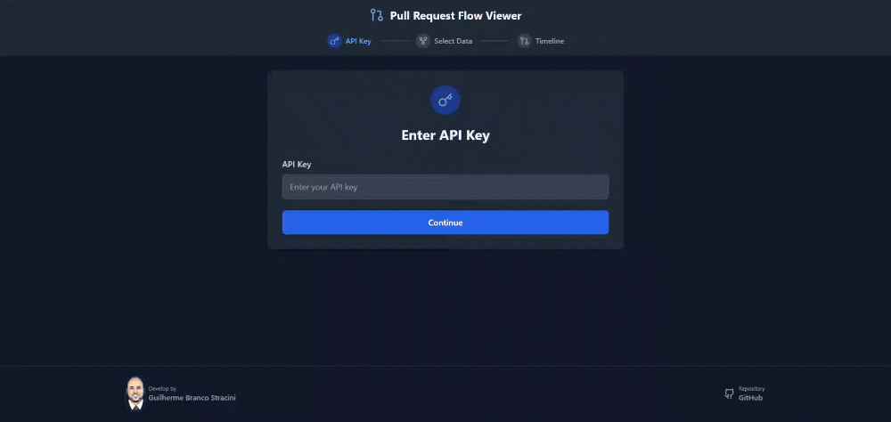

# 🏗️ Pull Request Flow Viewer

A sleek and interactive UI to visualize GitHub webhook events for pull requests! 🚀

## 🎯 Features

✅ Fetch and display **GitHub webhook events** in a structured table 📊  
✅ Store API key, repository, and PR selection **locally** to persist data 💾  
✅ Beautiful UI with TailwindCSS for an intuitive experience 🎨  
✅ Modular React components for better maintainability 🛠️  
✅ View JSON payloads with syntax highlighting ✨  
✅ Compare payload changes between webhook events 🔄  

## 📸 Preview



## 🚀 Getting Started

### 1️⃣ Clone the Repository

```sh
git clone https://github.com/your-username/github-webhooks-ui.git
cd github-webhooks-ui
```

### 2️⃣ Install Dependencies

```sh
npm install
```

### 3️⃣ Start the Development Server

```sh
npm run dev
```

## 🛠️ Configuration

Before using the app, ensure you have the **GitHub API URL** set up. The API URL, repository, and pull request number are stored in `localStorage` for convenience. 🎯

## 🏗️ Project Structure

```
📂 src
 ├── 📄 App.tsx
 ├── 📄 index.css
 ├── 📄 main.tsx
 ├── 📄 types.ts
 ├── 📄 vite-env.d.ts
 │
 ├── 📂 components
 │   ├── 📂 layout
 │   │   ├── 📄 Footer.tsx
 │   │   ├── 📄 Header.tsx
 │   │
 │   ├── 📂 select-data
 │   │   ├── 📄 ErrorMessage.tsx
 │   │   ├── 📄 PullRequestSelect.tsx
 │   │   ├── 📄 RecentPullRequests.tsx
 │   │   ├── 📄 RepositorySelect.tsx
 │   │   ├── 📄 SelectForm.tsx
 │   │
 │   └── 📂 timeline
 │       ├── 📄 BulletDiagram.tsx
 │       ├── 📄 EventItem.tsx
 │       ├── 📄 EventList.tsx
 │       ├── 📄 EventTimeline.tsx
 │       ├── 📄 JSONView.tsx
 │       ├── 📄 MermaidDiagram.tsx
 │       ├── 📄 MessageDisplay.tsx
 │       ├── 📄 PayloadCompareModal.tsx
 │       ├── 📄 PayloadModal.tsx
 │       ├── 📄 RefreshButton.tsx
 │
 ├── 📂 services
 │   ├── 📄 api.ts
 │
 ├── 📂 steps
 │   ├── 📄 ApiKeyStep.tsx
 │   ├── 📄 SelectDataStep.tsx
 │   ├── 📄 TimelineViewStep.tsx
 │
 └── 📂 utils
     ├── 📄 avatar.ts
     ├── 📄 events.ts
     ├── 📄 jsonTree.ts
```

## 📡 API Usage

This UI fetches GitHub PR events from:

```bash
GET {API_URL}/recent
GET {API_URL}/repositories/
GET {API_URL}/repositories/{owner}/{repository}/pulls/
GET {API_URL}/repositories/{owner}/{repository}/pulls/{pr_number}/
```

### API Endpoints Used:

- **GET /recent** - Lists all pull requests opened in the last 24 hours.
- **GET /repositories** - Returns a list of repositories with open pull requests.
- **GET /repositories/{owner}/{repository}/pulls** - Fetches all open pull requests for the given owner/org and repository.
- **GET /repositories/{owner}/{repository}/pulls/{pr_number}** - Retrieves all events related to a specific pull request.

## 🤝 Contributing

Feel free to fork, create a PR, or open issues! Your contributions are welcome. 💙

## 📜 License

This project is licensed under the MIT License. 📄
